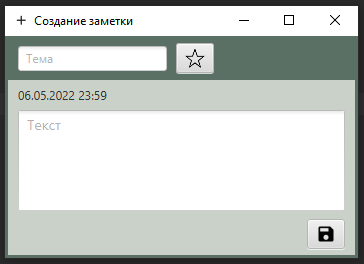
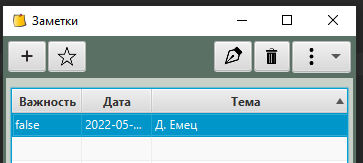
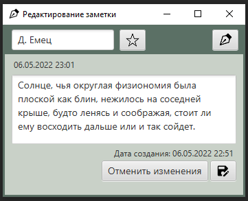
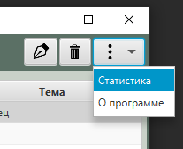

## _Приложение **Заметки**_
написано на языке **Java**

**Возможности:**

- Создание простейших заметок только с текстом. 

- Редактирование заметки в окне собственного приложения. 

- Сохранение заметки между сеансами приложения, при помощи SQLite.

- При первом запуске, приложение имеет одну заметку с текстом.

- Возможность редактирования любой заметки из списка.

- Удаление заметок  

- Есть возможность помечать важные заметки.

**Скриншоты приложения**

Стартовая страница:

 

При нажатии на “**+**”  открывается новое окно - добавления новой заметки:

Нажатие на **звездочку** - пометка **важно**!

Данные сразу сохраняются в базу данных.

При выборе на стартовом окне какой-либо строки появляются кнопки: “**важно**”, “**редактировать**”, “**удалить**”.

 

При нажатии на “**редактировать**” открывается новое окно:

 

При нажатии на “**ручку**” или по двойному щелчку на текст - текст становится доступным к редактированию.

Так же при нажатии на кнопку “**меню**” на главном экране можно посмотреть статистику приложения:

 
      

**Стек технологий**

IntelliJ IDEA, SceneBuilder, SQLite, Javafx, Maven, JDBC.

**jar**

Реализован при помощи плагин Apache Maven Shade.

При запуске .jar 

 - открывается уже созданный notes.db с сохраненными ранее записками;
 
 - если рядом с .jar нет notes.db, то откроется пустое поле, и щелкнув по знаку "*+*" можно создать первую новую заметку.
